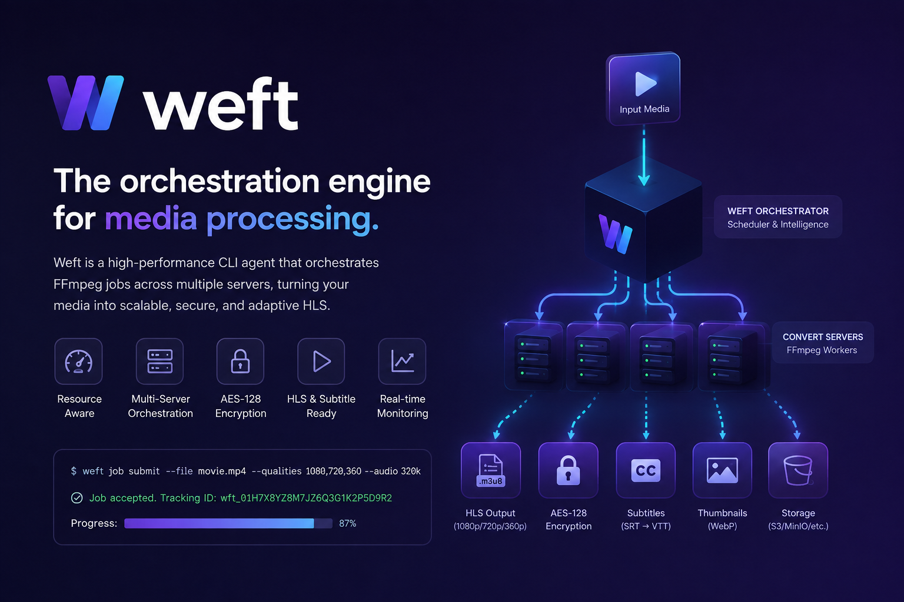

<div align="center">



# Weft

**A self-hosted media processing agent.** Feed it a video once — get the fully packaged output: H.264/HEVC HLS ladder, thumbnails, subtitles (incl. AI), master playlist, and upload to any storage.

**Durable · Crash-safe · Single static binary · No CGO · Event-sourced**

```
Weft — media processing agent
```

</div>

---

## Why Weft?

Media pipelines are fragile. Weft is designed as a **durable agent**: every state change and event is committed to a SQLite store **in one transaction**, so a crash mid-encode is recovered — not lost. It is not a wrapper around a script; it is a small distributed system you run on one box.

| Problem | Weft's answer |
|---|---|
| A long encode dies at 80% | Job is re-queued automatically when the worker lease expires; resume, don't restart |
| No visibility into what's happening | REST API + CLI + Prometheus metrics + HMAC-signed webhooks on every event |
| "It works on my machine" | `weft doctor` checks ffmpeg/ffprobe/config before you run anything |
| Post-production edits break a published video | `subtitle-add`, `dub-add` and `rebuild-master` update an existing HLS package in place |
| Subtitles in another language | `ai-subtitle` transcribes with **whisper.cpp** and translates/refines with **Gemini** (`hybrid`) |

---

## Features

- **DAG job pipelines** — profiles define task graphs (`vod-h264`, `audio`, `thumbnail`, `subtitle-add`, `dub-add`, `trim-update`, `poster-replace`, `ai-subtitle`); tasks run when all dependencies complete.
- **Durable event sourcing** — SQLite (WAL) store; every transition, event, and matching webhook outbox row commits atomically in one transaction.
- **Crash recovery** — workers lease tasks; expired leases are re-queued. No loss, no double-publish.
- **Priority queues** — `emergency → high → normal → low → background`, changeable on a queued job at runtime (`weft jobs priority`).
- **Smart concurrency** — worker pool auto-sizes to the host's CPU cores; an optional resource budget caps how much plugin-declared CPU/RAM cost can run at once, on top of measured-CPU admission gating.
- **Remote sources, not just remote destinations** — a job's input can be a relative path on a registered storage server or a direct `http(s)://` URL, fetched into a local cache automatically — not just local disk.
- **AI subtitles** — whisper.cpp (offline) and/or Gemini; `--provider whisper|gemini|hybrid`, `--src-lang` + `--lang` for transcription-then-translation.
- **Live progress** — whisper `-pp` and ffmpeg `-progress pipe:1` drive real progress events, surfaced via API and webhooks.
- **Live CLI dashboard** — `weft dashboard`: jobs, queue, workers, and host resources refreshed on an interval, with keyboard cancel/pause/resume/delete.
- **Webhooks** — at-least-once delivery, `X-Weft-Signature: HMAC-SHA256`, exponential backoff, dead-letter replay (`weft webhooks replay`).
- **Multi-storage** — local, SSH/SFTP, and S3 (hand-rolled SigV4, no SDK).
- **Master playlist recovery** — `POST /storage/rebuild-master` regenerates `playlist.m3u8` from whatever is actually on disk (recovers corrupted/old-binary masters).
- **Config export/import & cron** — back up/restore the running config; `cleanup`/`benchmark`/`health_scan` run on a schedule and are also triggerable by hand.
- **Security** — argon2id API keys with scopes; TLS supported.
- **Static binary** — pure Go, `modernc.org/sqlite` (no CGO), cross-compiled for linux/amd64 + linux/arm64.

---

## Quick start

```bash
# 1. Build (or download a release binary)
go build -o weft ./cmd/weft

# 2. Create a default config
./weft init-config

# 3. Check the environment
./weft doctor

# 4. Run the daemon
./weft serve --config weft.yaml
```

In another shell:

```bash
# Encode a video into HLS (360p..1080p) + thumbnails + subtitles + upload
weft jobs create /data/movie.mp4 --profile vod-h264

# Watch it
weft jobs get <job_id>
weft jobs list --status running

# AI subtitles: transcribe English audio, translate to Persian
weft jobs create /data/movie.mp4 --profile ai-subtitle --provider hybrid --src-lang en --lang fa

# Trim the clip before packaging (skip 50s from start, cut 10s off the end)
weft jobs create /data/movie.mp4 --profile vod-h264 --trim-start 50 --trim-end 10

# Custom thumbnails: exactly 5 evenly-spaced 1080x1080 stills instead of the
# default poster/sprite set; fetch one back as base64 from the API
weft jobs create /data/movie.mp4 --profile vod-h264 --thumb-count 5 --thumb-size 1080x1080
weft jobs get <job_id>            # lists produced assets (thumbnails included)
weft jobs asset <job_id> thumbnails/<base>_thumb_01.jpg
```

#### Trimming and thumbnails

`weft jobs create` accepts four extra flags:

| Flag | Meaning |
|---|---|
| `--trim-start <s>` | drop the first N seconds of the clip before HLS packaging (e.g. `50` starts at 50s) |
| `--trim-end <s>` | cut the last N seconds off the clip (e.g. `10` removes 10s from the end) |
| `--thumb-count <n>` | replace the default poster/sprite/stills with exactly N evenly-spaced thumbnails |
| `--thumb-size <w>x<h>\|original` | thumbnail dimensions, e.g. `1080x1080`, or `original` to keep source resolution (only used with `--thumb-count`) |

- Either or both of `--trim-start`/`--trim-end` may be set; both are applied to
  the `hls` **and** `thumbnail` tasks so the poster stills match the trimmed window.
- `--thumb-count` requires a profile that runs the `thumbnail` task (e.g.
  `vod-h264`, `vod-hevc`, `thumbnail`); thumbnails are uploaded to storage and
  listed under `assets` in `GET /jobs/{id}`.
- `weft jobs asset <job_id> <name>` returns the file as a base64 data URI via
  `GET /jobs/{id}/assets/{name}`, so you can fetch a thumbnail without touching
  the storage server directly.

---

## Architecture

```
┌─────────────┐     ┌──────────────────────────────────────────────┐
│  weft CLI   │────▶│  REST API (chi) · API keys · scopes          │
└─────────────┘     │  /jobs /queue /workers /webhooks /storage    │
                    └──────────────┬───────────────────────────────┘
                                   │ events (bus)
                    ┌──────────────▼───────────────────────────────┐
                    │  Scheduler (DAG + priority + lease expiry)   │
                    │  State Machine (legal transitions only)      │
                    └──────────────┬───────────────────────────────┘
                                   │ runnable tasks
                    ┌──────────────▼───────────────────────────────┐
                    │  Worker pool  ·  plugin registry (sandbox)   │
                    │  ffmpeg executor (-progress pipe:1)          │
                    └──────────────┬───────────────────────────────┘
                                   │ assets
                    ┌──────────────▼───────────────────────────────┐
                    │  Storage: local / SSH / S3  ·  upload plugin │
                    └──────────────────────────────────────────────┘

  Durable core:  SQLite (WAL) = store + event log + outbox (one txn)
```

### Layers

```
core/      Layer 1 — pure stdlib, zero I/O. Types, scheduler, state machine,
           event bus, lease store. Never touches disk/network.
runtime/   Layer 2 — implementations of core interfaces.
  store/sqlite    WAL SQLite store (durable event sourcing + outbox).
  executor/ffmpeg ffmpeg/ffprobe with `-progress pipe:1` parsing.
  registry/       plugin registry with panic sandbox.
  webhook/        HMAC-signed at-least-once delivery, backoff, dead letter.
  metrics/        Prometheus text export (hand-rolled, no deps).
  api/            chi REST API + argon2id API keys + scopes.
  worker/         worker loop (reserve → execute → mark done), resource budget.
  cron/           cleanup/benchmark/health_scan scheduler.
daemon/    The single assembly point (config → all components → Serve).
plugins/   Media + storage plugins (hls, subtitle, ai-subtitle, upload,
           poster_upload, ...).
profiles/  Profile → DAG templates (vod-h264, audio, ai-subtitle,
           trim-update, poster-replace, ...).
configs/   weft.yaml schema + startup validation.
cli/       Thin CLI over the API (serve, doctor, jobs, keys, dashboard, ...).
e2e/       Full lifecycle test over the real daemon (fake ffmpeg).
chaos/     Failure injection: plugin panic, lease expiry, webhook retry.
```

### Job lifecycle

```
queued → reserved → running → uploading → completed
                       ↕ paused/resumed
             └──────── (any step fails) ───────▶ failed
```

- A task becomes runnable the moment all DAG dependencies are done.
- Every state change + its event + any matching webhook outbox row commits in **one transaction**.
- Workers lease tasks; a crashed worker's task is **re-queued** when the lease expires.
- A resumed job behaves exactly like a running one for every later transition — pausing is not a dead end.

---

## Configuration

`weft init-config` writes a full `weft.yaml` with defaults. Everything validates at startup — a broken provider refuses to boot.

```yaml
network:
  listen: 127.0.0.1:8443
security:
  api_keys: true
  admin_api_key: "<set this>"
ai_subtitle:
  provider: whisper            # whisper | gemini | hybrid
  whisper:
    model_path: "/opt/weft/models/ggml-medium.bin"
    language: "en"             # source language of the audio
    threads: 8
    temperature: 0.0           # deterministic output
    prompt: "Spider-Man, Peter Parker, Zendaya"
  gemini:
    api_key: ""                # required for hybrid translation
    model: "gemini-1.5-flash"
    language: "fa"             # target language
```

See [docs/SETUP-FA.md](docs/SETUP-FA.md) for the full configuration reference and deployment guide.

---

## CLI reference

```
weft serve [--config <path>]           run the agent daemon
weft init-config [<path>]              write a default weft.yaml
weft doctor [--config <path>]          check ffmpeg, config, db, connectivity
weft version                           print version

weft jobs list [--status S] [--priority P] [--limit N]
weft jobs get <id>
weft jobs create <input_ref> --profile <name> [--priority P]
                [--destination N] [--source-server N] [--path P] [--name N]
                [--lang L] [--src-lang S] [--provider whisper|gemini|hybrid]
                [--trim-start S] [--trim-end S]
                [--thumb-count N | --thumb-at S] [--thumb-size WxH|original]
                [--forced] [--default]
weft jobs events <id> | log <id> <task_id> | asset <id> <name>
weft jobs action <id> <cancel|retry|pause|resume>
weft jobs priority <id> <emergency|high|normal|low|background>
weft jobs delete <id>

weft keys create <name> <scope...> | keys list | keys delete <id>
weft webhooks create <url> <event...> [--secret S] | list | delete <id> | replay <event_id>
weft storage list | add <id> <type> [--host H] [--user U]
weft queue | workers [scale <n>] | profiles | plugins | metrics | system
weft benchmark [run] | benchmark get
weft config export [--out F] [--include-secrets] | config import <file>
weft cron list | cron run <cleanup|benchmark|health_scan>
weft dashboard [--interval 2s]     # live TUI: jobs/queue/workers/system, select+act
```

All remote commands accept `--api <url>` and `--key <token>`.

---

## REST API

| Method | Path | Scope |
|---|---|---|
| GET | `/health` | — |
| GET/POST | `/jobs` | `jobs:read` / `jobs:write` |
| GET | `/jobs/{id}`, `/jobs/{id}/events`, `/jobs/{id}/tasks/{taskID}/log`, `/jobs/{id}/assets/{name}` | `jobs:read` |
| DELETE | `/jobs/{id}` | `jobs:write` |
| PATCH | `/jobs/{id}/priority` | `jobs:write` |
| POST | `/jobs/{id}/{action}` (cancel/retry/pause/resume) | `jobs:write` |
| GET | `/queue`, `/workers` | `queue:read`, `workers:read` |
| POST | `/workers/scale` | `workers:write` |
| GET/POST | `/storage/servers` | `storage:manage` |
| POST | `/storage/rebuild-master` | `storage:manage` |
| GET/POST/DELETE | `/webhooks` (+ `/webhooks/{id}/replay`) | `webhooks:manage` |
| GET/POST/DELETE | `/keys` | `keys:manage` |
| GET | `/profiles`, `/plugins` | `profiles:read`, `plugins:read` |
| POST/GET | `/benchmark`, `/metrics`, `/system` | `metrics:read` |
| GET/POST | `/config/export`, `/config/import` | `config:manage` |
| GET/POST | `/cron`, `/cron/{job}/run` | `cron:manage` |

Error responses are structured: `{"error": {"code": "...", "message": "..."}}`. Full reference (request/response shapes, worked examples): [docs/REFERENCE.md](docs/REFERENCE.md).

---

## Webhooks

Every domain event is fanned out to the outbox and delivered **at-least-once**:

```
X-Weft-Event: job.completed
X-Weft-Signature: HMAC-SHA256(secret, body)
```

Wire events include `job.created`, `job.started`, `job.progress`, `task.progress`, `job.completed`, `job.failed` and more. Failed deliveries retry with exponential backoff and land in a replayable dead-letter log.

---

## Development

```bash
go build ./...      # build everything
go vet ./...        # static checks
go test ./...       # unit + integration + chaos (integration skips without ffmpeg)
```

Cross-compile for Linux:

```bash
GOOS=linux GOARCH=amd64 CGO_ENABLED=0 go build -ldflags "-s -w" -o dist/weft-linux-amd64 ./cmd/weft
GOOS=linux GOARCH=arm64 CGO_ENABLED=0 go build -ldflags "-s -w" -o dist/weft-linux-arm64 ./cmd/weft
```

> No CGO: SQLite is `modernc.org/sqlite` (pure Go), S3 is hand-rolled SigV4 — the daemon is one static binary.

---

## Vision

Weft is a **self-hosted media processing agent** evolving from an early open-source project into a production-grade orchestration platform for multimedia workloads. Our long-term vision is simple: **make multimedia infrastructure as programmable, scalable, and reliable as modern cloud infrastructure.**

We want Weft to become the infrastructure layer where companies can run video, audio, streaming, and AI media workloads without having to build their own orchestration platform from scratch.

---

## Roadmap

Weft already supports core media-processing workflows, including distributed FFmpeg processing, HLS generation, subtitles, thumbnails, encryption, and AI-powered subtitle processing. Our next roadmap is focused on expanding these capabilities while building the infrastructure underneath them:

- **Distributed Media Orchestration** — reliable scheduling and execution of multimedia workloads across multiple servers.
- **Resource-Aware Scheduling** — intelligent scheduling based on CPU, RAM, disk, GPU, concurrency, and worker availability.
- **Advanced Job Management** — priorities, retries, pause/resume, crash recovery, dependencies, persistent state, and automatic workload redistribution.
- **AI Subtitle & Localization** — expanding the existing AI subtitle capabilities into automatic transcription, translation, subtitle synchronization, quality improvement, and multi-language localization workflows.
- **AI Media Processing** — adding AI-powered workflows for tasks such as speech detection, audio enhancement, scene analysis, metadata generation, content understanding, and automated media enrichment.
- **Advanced Video Processing** — encoding pipelines, HLS/DASH packaging, multiple quality profiles, thumbnails, previews, audio processing, encryption, and automated media optimization.
- **GPU Workloads** — support for GPU-aware scheduling and AI/video workloads that require dedicated GPU resources.
- **Media Workflow Pipelines** — allowing complex processing workflows to be defined as reusable pipelines with dependencies between jobs.
- **Observability & Operations** — real-time monitoring, metrics, logs, worker health, resource usage, job progress, and failure analysis.
- **Storage & Cloud Integrations** — flexible integration with S3-compatible storage, local storage, object storage, and different deployment environments.
- **Kubernetes-like Multimedia Orchestration** — our long-term goal is to build an orchestration layer specifically designed for video and audio workloads, bringing the concepts of scheduling, workers, resources, scaling, and recovery to multimedia infrastructure.

Development of the roadmap is funded through subscriptions, which help fund development infrastructure, multi-server and GPU testing environments, AI processing costs, real-world workload testing, documentation, and developer tooling.

---

## Documentation

- [docs/README.md](docs/README.md) — architecture overview
- [docs/REFERENCE.md](docs/REFERENCE.md) — complete reference manual (config, CLI, API, webhooks, AI subtitles)
- [docs/SETUP-FA.md](docs/SETUP-FA.md) — setup, configuration, deployment
- [docs/GUIDE-FA.md](docs/GUIDE-FA.md) — user guide
- [docs/CLI-API-FA.md](docs/CLI-API-FA.md) — CLI + API reference

---

## License

[MIT](LICENSE) © Mohammad Jaf
